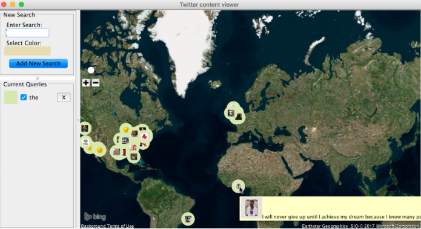

# MyTwitterMapper
Final Project for edX's Software Construction Object Oriented Design Course.

The project uses Twitter's API to display tweets that match a keyword that the user provides.
The tweets are displayed on a glopal map.
The app makes use of an existing geographical mapping library and the Twitter API.

The project has two phases : 
#### 1-connect to the Twitter service to receive tweets, and selects those tweets that match any of the patterns that are specified by the user of the application

#### 2- display a marker corresponding to the location in the world of the originator of each matching tweet, including defining tool-tips that show the text of each tweet when the user hovers over the map marker with the mouse.

## The project focuses on Applying Observable Pattern ,Iterator Pattern , Unit Testing and UML Design

 ### At Start :
 
 
 ### Currently:
 
 
 
 ### the desired look :
 
